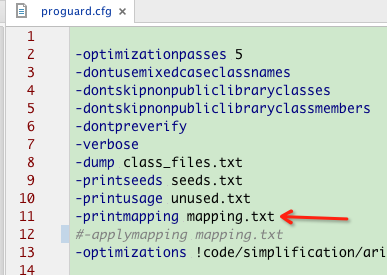
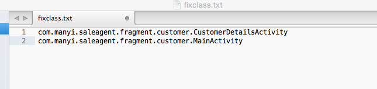
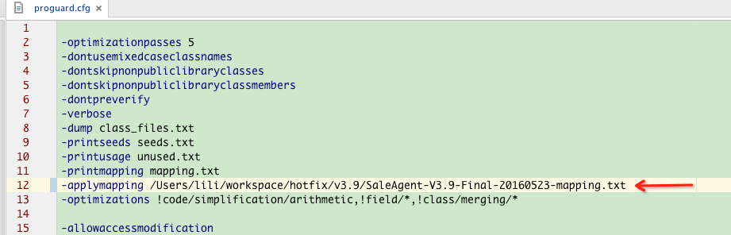
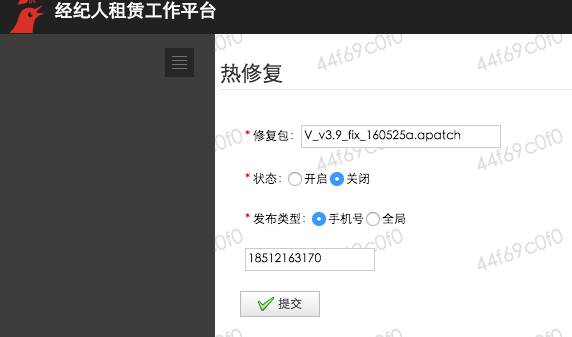

##如何使用
1. 在proguard文件中加入`-printmapping mapping.txt`，将生成的mapping.txt文件保存，生成补丁文件需要使用。
2. 修复错误代码，将修改的class名写入fixclass.txt(如：com.manyi.saleagent.MainActivity)文件，每行代表一个修改的文件。
3. 在proguard文件中加入`-applymapping mapping.txt`(出错可以使用mapping文件的绝对路径)，生成修复后的new.apk文件。
4. 得到修复后的new.apk，使用apkpatch-aa生成补丁文件(\*.apatch)，具体命令查看下文的**[补丁包生成](#user-content-补丁包生成)**。
5. 生成的补丁文件参考**[补丁文件名格式](#user-content-补丁文件名格式)**重命名文件，建议使用带版本的文件名。
6. 通过**[上传补丁文件地址](#user-content-上传补丁文件地址)**上传补丁文件，(如，出售APP的补丁文件在`出售App Bugfix`分类下，上传文件后，不需要点发布按钮)
7. 通过**[配置开关地址](#user-content-配置开关地址)**配置补丁生效，建议先使用手机号发布，测试无问题后再切换到全局。
8. 发布新版本APP之前，通过**[配置开关地址](#user-content-配置开关地址)**关闭补丁。

##补丁文件名格式
```
一般使用：V_v3.0_fix_160411a(原文件名后缀保持不变)
使用带版本号，防止发布新版本时，补丁错误应用在新版本上。

全局修复：A_<fix|rv>[_rs][_now]_160411a.apatch
单独用户：U_18512199920_<fix|rv>[_rs][_now]_160411a.apatch
设备型号：D_Xiaomi,MI 3_v3.0_<fix|rv>[_rs][_now]_160411a.apatch
IMEI：I_865291026762517_v3.0_<fix|rv>[_rs][_now]_160411a.apatch
城市：C_2_v3.0_<fix|rv>[_rs][_now]_160411a.apatch
MIUI版本：M_V76331_v3.0_<fix|rv>[_rs][_now]_160411a.apatch
APP版本：V_v3.0_<fix|rv>[_rs][_now]_160411a.apatch

fix：执行修复
rv：取消修复，恢复到之前的代码
rs：应用补丁后重新启动APP(5.0之前的版本生效，5.0之后的版本默认退出APP)
now：下载补丁后立刻应用(默认是在应用处于后台时才应用补丁)
160411a：确定唯一
```

##配置开关地址：

    dev：http://rentconsole.iwjwdev.com/IWAgentRentConsole/appbugfix/findBykey.d
    test：http://rentconsole.iwjwtest.com/IWAgentRentConsole/appbugfix/findBykey.do
    beta：http://rentconsole.iwjwbeta.com/IWAgentRentConsole/appbugfix/findBykey.do
    prod：http://rentconsole.superjia.com/appbugfix/findBykey.do
    dev，test登陆账号：19000000015（Aaa123）
    beta，prod登陆账号：18512199920（Aaa123）

##上传补丁文件地址：

    dev，test：
    http://192.168.1.75/user/main.do
    用户名秘密：Admin iwjwAdmin

    beta：
    http://121.41.34.206:8150/user/main.do
    用户名秘密：Admin iwjwAdmin
    

    prod:
    http://121.43.144.46/user/login.do
    用户名秘密：Admin iwjwAdmin

##补丁包生成

    为配合AndroidAnnotations，使用apkpatch-aa.sh生成补丁文件。
    ./apkpatch-aa.sh -f new.apk -t old.apk -o outdir -k keystore -p password -a alias -e password -fc fixclass.txt -mf mapping.txt
    fixclass.txt：需要修复的class列表
    mapping.txt：混淆映射关系


